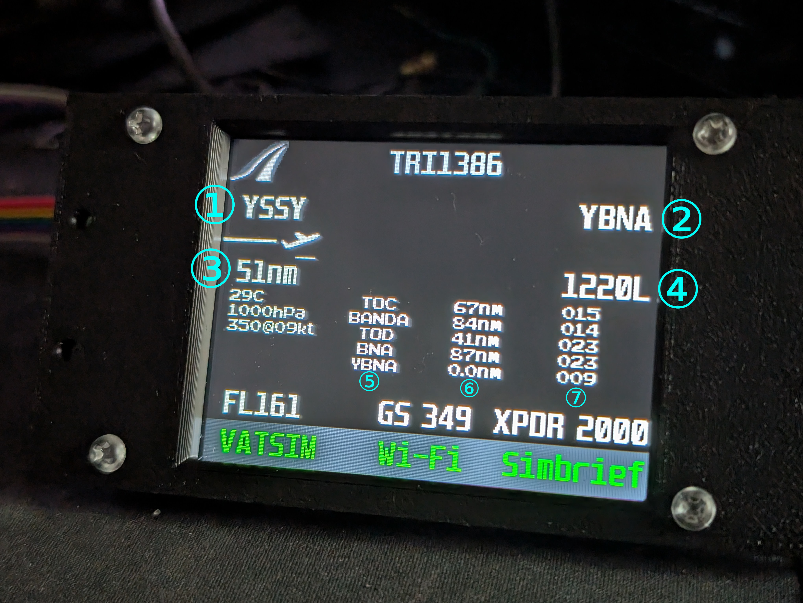
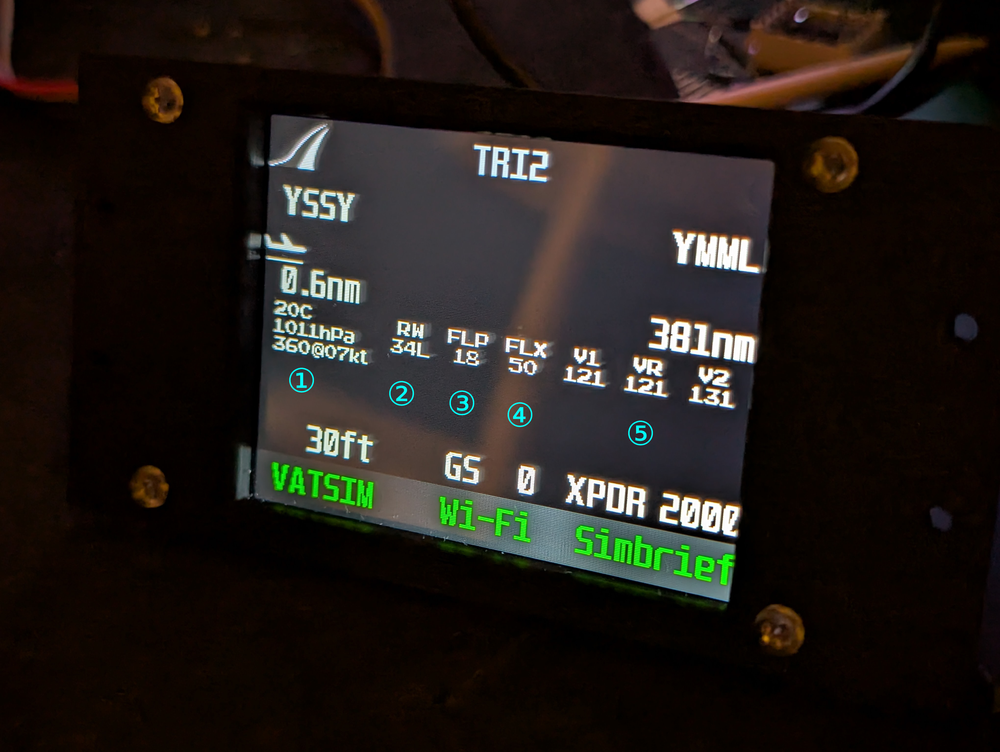
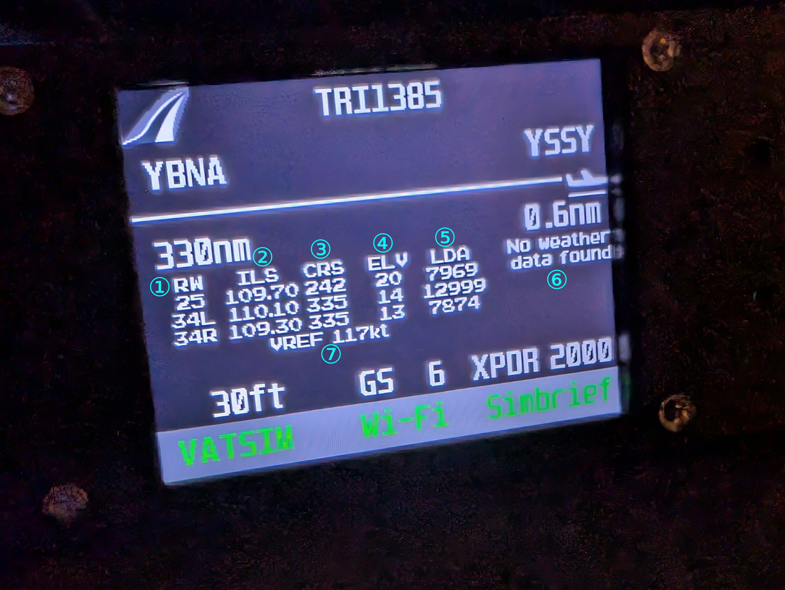
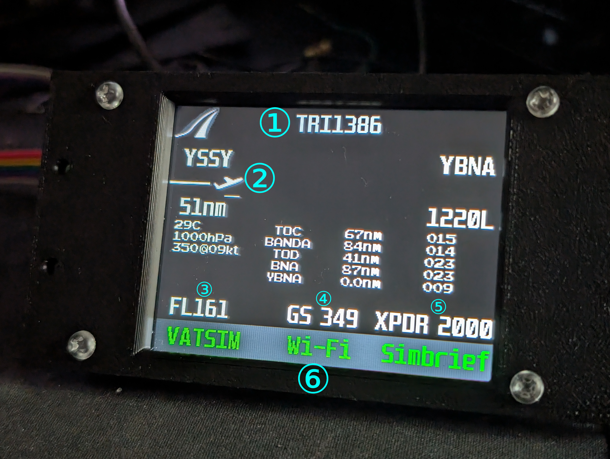

# Overview

This project is designed to allow flight simulator users to turn an ESP32 development board and an ILI9341 LCD into a live display to either aid their flights or just look great on their desk. Most functionality requires the included FastAPI server to be running on the same local network as the ESP32.

This project was developed with my own personal use in mind, and prioritised ease of development and functionality over optimisation and convenience. You are welcome to do what you like with it, although it is unlikely to work out of the box without some tinkering.

A version of this project using the SimConnect SDK was developed but I am currently unable to locate it.

# ⚠️ Domain Knowledge
As a display intended for use in conjunction with flight simulation software, the project requires some relevant knowledge in order to understand its functionality and code.

# Sources
This project makes use of files from [rdagger](<https://github.com/rdagger>)'s micropython-ili9341 repository [on GitHub](<https://github.com/rdagger/micropython-ili9341>):
- `ili9341.py` as a driver to interface with the display over SPI.
- `img2rgb565.py` as a utility to convert PNG images to the required format. 
- `xglcd_font.py` to use fonts on the display.
- `ArcadePix9x11.c` and `UnispaceExt12x24.c` as fonts (not included).

# Features

### Navigation
To reach their destination safely, a pilot must know where they are, where they need to go, and how they will get there. Most flight plans include a route, which is a set of *waypoints* that the pilot will fly *legs* between. Aside from a pilot's own eyes and spatial awareness, numerous instruments can be used to guide an aircraft along its route.


The display shows: 
1. The [ICAO code](<https://en.wikipedia.org/wiki/ICAO_airport_code>) of the flight's origin airport (Sydney)
2. The ICAO code of the flight's destination (Ballina)
3. The (straight-line) distance travelled from the origin
4. A rotating display that cycles between:
    - The (straight-line) distance to the destination;
    - The estimated arrival time in UTC;
    - The estimated arrival time in the destination's timezone.
5. The identifiers of the next waypoints along the aircraft's route,
6. The distance either *to* the waypoint or *between* the waypoint and the previous waypoint (*leg* distance) and
7. The *track* either *to* the waypoint or *between* the waypoint and the previous waypoint (*leg* track).

### Takeoff & Landing
Both taking off and landing require the pilot to have complex information about how the aircraft should be configured and flown, as well as up-to-date information about local weather conditions.

The display shows:
|| Takeoff | Landing |
|-|-|-|
||||
|1.|Local weather, if available|The frequency of the [ILS](<https://en.wikipedia.org/wiki/Instrument_landing_system>) localiser|
|2.|The planned runway|The planned runway *and* other runways at the airport that [have a headwind](<https://en.wikipedia.org/wiki/Headwind_and_tailwind#Travel:~:text=is%20favorable%20in%20takeoffs%20and%20landings>)|
|3.|The required [flap setting](<https://en.wikipedia.org/wiki/Flap_(aeronautics)#Flaps_during_takeoff>)|The runway *course*|
|4.|The required [flex temperature](<https://en.wikipedia.org/wiki/Flex_temp>)|The elevation of the runway|
|5.|The [V-speeds](<https://en.wikipedia.org/wiki/V_speeds>) for takeoff|The [available runway length for landing](<https://en.wikipedia.org/wiki/Runway#Declared_distances:~:text=Landing%20Distance%20Available%20%28LDA>)|
|6.||Local weather, if available|
|7.||The [V<sub>Ref</sub> speed](<https://en.wikipedia.org/wiki/V_speeds#Regulatory_V-speeds:~:text=19%5D-,VRef>)|

### Other displayed information
Some additional information is displayed at all times:


1. The [callsign](<https://en.wikipedia.org/wiki/Aviation_call_sign#Commercial_airline>) of the aircraft
2. The progress of the flight by (straight-line) distance to the origin and destination, with an associated icon depending on the phase of flight (on ground, climb, cruise, descent)
3. The altitude of the aircraft, displayed as [flight level](<https://en.wikipedia.org/wiki/Flight_level>) when above the [transition altitude](<https://en.wikipedia.org/wiki/Flight_level#Transition_altitude>)
4. The [ground speed](<https://en.wikipedia.org/wiki/Ground_speed>) of the aircraft
5. The [squawk code](<https://en.wikipedia.org/wiki/Transponder_(aeronautics)#Transponder_codes>) set on the aircraft's transponder
6. Coloured text indicating the status of connections to VATSIM, Wi-Fi and Simbrief:
    |Colour|Status|
    |--|--|
    |White|Uninitialised|
    |Red|Disconnected|
    |Green|Connected|
    |Blue|Download in progress|

# API Integrations

### VATSIM's [Slurper](<https://vatsim.dev/api/slurper-api/get-user-info>) and [Data](<https://vatsim.dev/api/data-api/get-network-data>) APIs
[VATSIM](<https://vatsim.net/>) is a popular network that allows flight simulation enthusiasts to fly aircraft and provide air traffic control services in a synchronised multiplayer environment. This project uses its APIs to retrieve live data about a user's position, altitude, speed, heading and transponder (squawk) code.

### Simbrief's [OFP API](<https://developers.navigraph.com/docs/simbrief/fetching-ofp-data>)
[Simbrief](<https://www.simbrief.com>) is a free flight planning tool for flight simulation enthusiasts. This project uses its APIs to retrieve information about a user's flight plan including route, take-off, landing and scheduling data. 

### The NOAA Aviation Weather Center's [Data API](<https://aviationweather.gov/data/api/>)
Whilst it often works only intermittently, this project uses this API (when available) to display information about the weather in the vicinity of the user.

# Implementation Notes

## Weather API
The [API](<#the-noaa-aviation-weather-centers-data-api>) I decided to use to retrieve weather information is, at best, inconsistent. There are a couple of local data sources I could use (such as scraping BOM's website), but I figured that an API that provides global weather information would be less likely to leave me hanging on the somewhat rare occasion I fly outside Australia. Further, the NOAA seems more than happy to let me make a few requests per minute, which I cannot say about some of the local sources I found.

## Why not C++?
The ESP32 development board is rather inexpensive and has support for wireless networking, making it a good choice for a project that relies on retrieving data from the Internet. However, a cursory glance at the project's code (or <a href="#overview">the Overview above</a>) will tell you that it sources some data from a server over a local network. The rationale for this is (relatively) simple: MicroPython on the ESP32 does <b>NOT</b> support multithreading.

With some APIs (<a href="#vatsims-slurper-and-data-apis"><i>ahem</i></a>) returning bodies on the order of 1MB, the only available thread gets stuck for upwards of 10 seconds, preventing the display from being updated; this is obviously not ideal when multiple APIs need to be called fairly often. C++, however, *does* support multithreading, so the question naturally arises:

### C++
How self-referential of me. In a nutshell, I have comparatively far less experience programming in C++ as opposed to Python; were this project intended from the get-go to be shared among a wider audience, I likely would have used it. I primarily wanted something working "well enough" (insert the adage about nothing being more permanent than a temporary solution) so development time was the biggest concern for both me and my then-unmedicated ADHD.

### Minimal further set-up
I wouldn't consider this an argument against C++ as much as an argument against *not* Python. You're going to be using this while running a flight simulator. I'd guess you absolutely have a computer running that you could use to, say, host a FastAPI server to process API responses so a single-threaded application can save its CPU time for something important. One could argue that thus preventing the unit from being self-contained is a net negative; whilst I agree, I believe that very few people would have a use case for running one without a PC running nearby (and, again, this project was never intended for a wider audience).

### Fonts
Whilst there [is](<https://github.com/Matiasus/ILI9341>) a C library for ILI9341 displays, it seems that I would have to encode the fonts myself, which is a lot of extra work (to say nothing of the already increased development time) when I could just as easily (well, more easily) use fonts provided with the MicroPython library which have very conveniently been set up for use with the `xglcd_font` code.

# Repository Structure

```
│   README.md              You are here
│
├───board
│       ili9341.py         See "Sources"
│       main.py            Main program code, executed automatically when the board boots
│       *.raw              Icons to display flight progress
│       server.txt         Address of the FastAPI server
│       simbrief_id.txt    ID of the Simbrief user to retrieve the flight plan of
│       tail44x30.raw      Logo for flavour
│       vatsim_cid.txt     CID of the VATSIM user to retrieve session data of
│       wifi_*.txt         WLAN credentials
│       xglcd_font.py      See "Sources"
│
├───images
│       img2rgb565.py      See "Sources"
│       *.png              PNG versions of the .raw files in board/
│
├───readme                 Assets used in this README
│
└───server
        server.bat         Batch file to start the FastAPI server
        server.py          FastAPI server to process information from VATSIM and Simbrief before sending to the board
```